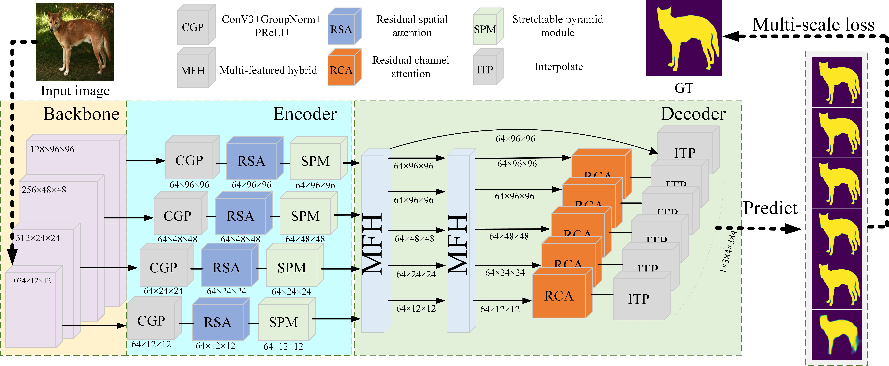

# SPRA: Stretchable Pyramid and Residual Attention Network for Salient Object Detection
by Xinlong Liu, Jixing Guo, Zhishe Wang, Member, IEEE, Dong Wang
## Introduction
Models using encoder-decoder structures often show excellent performance in salient object detection (SOD) tasks. For the SOD network, typical challenges include the difficulty in preserving important information during the fusion of features extracted at different scales, as well as the local information loss caused by complex shapes. These shortcomings hinder the model's ability to accurately locate salient objects with large scale variations and complex deformations, leading to confusion between boundaries and backgrounds. To address these problems, we proposed stretchable pyramid and residual attention network (SPRANet). First, for local information extraction, we use a stretchable net structure combined with a pyramid (SP) module to flexibly capture key objects of different scales and shapes, while protecting the edge integrity of the overall structure. At the same time, we added residual structures to two types of traditional attention modules (spatial and channel attention) to form residual attention (RA) modules, and placed them in appropriate positions within the model to better preserve the extracted features. Then, other different-scale feature processing modules are merged with the input and output of the attention module to make it pay more attention to the key information in the fusion process, reducing the influence of noise and background. Through the encoding and decoding processes of these modules, the model achieves excellent predictions on objects of varying scales in complex backgrounds while preserving clear and complete edges. By comparing with other methods on five public datasets, it is verified that the proposed network has achieved good performance in both visual perception and evaluation indicators. 


We provide the [salient maps](通过百度网盘分享的文件：SPRANet.zip
链接：https://pan.baidu.com/s/1YfpvTZd5e-zpNVAtTZ9enw?pwd=SPRA 
提取码：SPRA) (Fetch Code:SPRA) for comparisons,  including DUTS-OMRON, DUTS-TE, ECSSD, HKU-IS, PASCAL-S.  The folder also contains the datasets used, the pretrained model, and our resulting model.

## train
```
python3 train.py
```


## test
```
python3 test.py
```
- After training, the result models will be saved in `out` folder

## Acknowledgement
 The evaluation code comes from: https://github.com/zyjwuyan/SOD_Evaluation_Metrics.
Our work is based on [F3Net](https://github.com/weijun88/F3Net).
We fully thank their open-sourced code.
